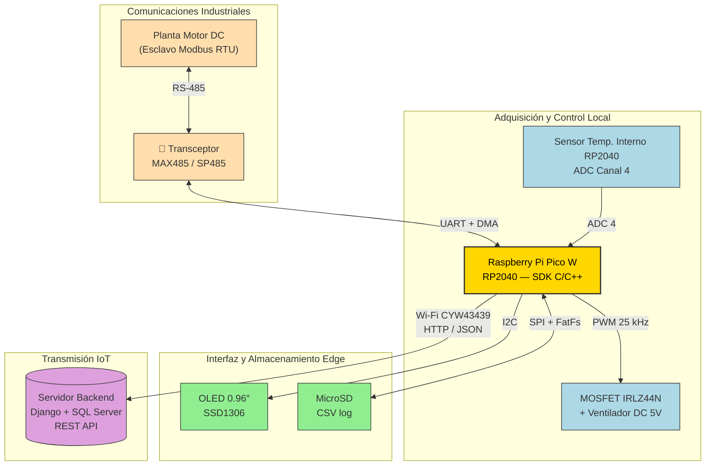

# Nodo de Edge Computing y Gateway IoT para Monitorización Industrial

<div align="center">


**Autor:** Brando Enrique Chávez Vergara · `brandon.chavez@udea.edu.co`
**Asignatura:** Digitales 3 — Universidad de Antioquia (UdeA)
**Modalidad:** Individual
**SDK / Lenguaje:** Raspberry Pi Pico SDK · C/C++
**Flujo de programa:** *Polling + Interrupciones* (único flujo válido)

</div>

---

## Tabla de contenido

- [Descripción del proyecto](#-descripción-del-proyecto)
- [Diagrama de bloques](#-diagrama-de-bloques)
- [Requisitos funcionales](#-requisitos-funcionales)
- [Requisitos no funcionales](#-requisitos-no-funcionales)
- [Arquitectura de software](#-arquitectura-de-software)
- [Estructura del repositorio](#-estructura-del-repositorio)
- [Estrategia de ramas (Git-Flow)](#-estrategia-de-ramas-git-flow)
- [Lista de materiales (BOM)](#-lista-de-materiales-bom)
- [Pinout](#-pinout)
- [Compilación y carga](#-compilación-y-carga)
- [Backend (Django)](#-backend-django)
- [Documentación adicional](#-documentación-adicional)

---

## Descripción del proyecto

Sistema embebido basado en **Raspberry Pi Pico W (RP2040 + CYW43439)** que
opera como **nodo de Edge Computing** y **gateway IoT industrial**. El
firmware, escrito completamente en **C/C++ con el Raspberry Pi Pico SDK**,
implementa las siguientes funciones:

| Función | Descripción técnica |
|---------|---------------------|
| **Adquisición Modbus RTU** | Lee Holding Registers (FC 03) de una Planta Educativa de Motor DC a 9600 baud sobre RS-485 (transceptor MAX485). Uso de **DMA** para TX/RX. |
| **Sensado térmico (Edge)** | Sensor interno del RP2040 vía **ADC canal 4**. Conversión por la fórmula de la hoja de datos. |
| **Control proporcional PWM** | Lazo cerrado: T → duty cycle. PWM a 25 kHz (fuera de banda audible), 8 bits, manejando un MOSFET IRLZ44N. |
| **HMI local OLED** | Pantalla SSD1306 128×64 vía I2C 400 kHz. Muestra IP, estado Wi-Fi, T, duty y errores. |
| **Gateway IoT** | Empaqueta telemetría en JSON (RFC 8259) y la envía por HTTP POST al backend Django + SQL Server. |
| **Datalogger offline** | Si Wi-Fi cae, escribe CSV en microSD (SPI + FatFs). Sincroniza al reconectarse. |

---

## Diagrama de bloques



---

## Requisitos funcionales

| ID | Requisito | Estado |
|----|-----------|--------|
| **RF1** | Comunicación Modbus RTU (RS-485) — leer Holding Registers del esclavo | 60 % |
| **RF2** | Medición de temperatura interna del RP2040 (ADC4)                    | 90 % |
| **RF3** | Control PWM proporcional del ventilador                              | 75 % |
| **RF4** | HMI local en pantalla OLED (I2C)                                     | 70 % |
| **RF5** | Empaquetado JSON y transmisión HTTP/REST al backend                  | 55 % |
| **RF6** | Datalogger CSV en microSD ante pérdida de Wi-Fi                      | 40 % |

---

## Requisitos no funcionales

| ID | Requisito | Implementación |
|----|-----------|----------------|
| **RNF1** | Tolerancia a fallos (sin pérdida de datos al caer Wi-Fi) | FSM `ONLINE`/`OFFLINE_LOG` + escritura CSV |
| **RNF2** | Precisión de tiempos Modbus (silencio 3.5 char) | Timer hardware + DMA + canales dedicados |
| **RNF3** | Interoperabilidad — JSON RFC 8259 | Construcción con `snprintf()` (sin librerías) |

---

## Arquitectura de software

Modelo: **polling + interrupciones** (único flujo autorizado).
ISRs cortas → modifican `volatile flags` → super-loop sondea y delega.

### Subsistemas (módulos)

| Carpeta | Responsabilidad |
|---------|-----------------|
| `firmware/src/temperature/` | Lectura ADC4 y conversión a °C |
| `firmware/src/pwm_ctrl/`    | Lazo proporcional PWM |
| `firmware/src/modbus/`      | Maestro Modbus RTU + DMA + CRC-16 |
| `firmware/src/oled/`        | Driver SSD1306 sobre I2C |
| `firmware/src/sdcard/`      | Datalogger CSV (FatFs sobre SPI) |
| `firmware/src/wifi/`        | Init y monitor del CYW43439 |
| `firmware/src/http/`        | Cliente HTTP POST + serialización JSON |
| `firmware/src/statemachine/`| FSM global `INIT/ONLINE/OFFLINE/ERROR` |

### Interrupciones declaradas

| Fuente              | Vector RP2040       | Prioridad | Acción |
|---------------------|---------------------|-----------|--------|
| UART0 RX (Modbus)   | `UART0_IRQ`         | ALTA      | Push byte → reinicia timer 3.5 char |
| Timer 3.5 char      | `TIMER_IRQ_3`       | ALTA      | `flag_modbus_rx_done = true` |
| DMA TX Modbus       | `DMA_IRQ_0`         | MEDIA     | Cambia DE/REₙ del MAX485 |
| PWM wrap            | `PWM_IRQ_WRAP`      | BAJA      | Tick del lazo de control (100 Hz) |
| Wi-Fi (CYW43)       | gestionado por SDK  | N/A       | `cyw43_arch_poll()` en super-loop |

### Uso de DMA

| Canal | Dirección             | DREQ                 | Uso                          |
|-------|-----------------------|----------------------|------------------------------|
| DMA0  | MEM → UART0_TX        | `DREQ_UART0_TX`      | Envío trama Modbus           |
| DMA1  | UART0_RX → MEM        | `DREQ_UART0_RX`      | Recepción trama Modbus       |

### FSM global

```
INIT ──init OK──▶ ONLINE ──Wi-Fi cae──▶ OFFLINE_LOG ──Wi-Fi vuelve──▶ ONLINE
  │                  │                       │
  │                  └──timeout x3───────────┴──SD fail──▶ ERROR ──watchdog reset──▶ INIT
  └──init fallo─────────────────────────────────────────▶ ERROR
```

---

## Estructura del repositorio

```
IoT_Edge_Gateway/
├── CMakeLists.txt              # Build root (Pico SDK)
├── pico_sdk_import.cmake       # Import del SDK
├── README.md                   # Este documento
├── LICENSE                     # MIT
├── .gitignore
│
├── docs/                       # Documentación
│   └── answers/                # PDFs individuales del cuestionario
│       ├── Brando_Chavez_pregunta_1.pdf
│       ├── Brando_Chavez_pregunta_2.pdf
│       ├── Brando_Chavez_pregunta_3.pdf
│       ├── Brando_Chavez_pregunta_4.pdf
│       ├── Brando_Chavez_pregunta_5.pdf
│       └── Brando_Chavez_pregunta_6.pdf
│
├── firmware/                   # Código C/C++ del Pico W
│   ├── CMakeLists.txt
│   ├── include/
│   │   └── config.h            # Pinout, parámetros globales, structs
│   └── src/
│       ├── main.c              # Super-loop polling + interrupciones
│       ├── modbus/             # Modbus RTU con DMA
│       ├── wifi/               # CYW43439 + lwIP
│       ├── http/               # Cliente HTTP + JSON
│       ├── oled/               # SSD1306 sobre I2C
│       ├── sdcard/             # Datalogger CSV con FatFs
│       ├── temperature/        # ADC4 sensor interno
│       ├── pwm_ctrl/           # Lazo proporcional PWM
│       └── statemachine/       # FSM global
│
├── backend/                    # Django + SQL Server
│   ├── README.md
│   └── iot_api/
│       ├── models.py
│       ├── views.py
│       ├── urls.py
│       └── admin.py
│
└── hardware/                   # Esquemas y BOM
    ├── BOM.csv
    └── schematics/
        └── CONNECTIONS.md      # Guía completa de conexiones
```

---

## Estrategia de ramas (Git-Flow)

| Rama                          | Tipo       | Propósito |
|-------------------------------|------------|-----------|
| `main`                        | permanente | Código estable, liberable |
| `develop`                     | permanente | Integración continua |
| `feature/modbus-driver`       | temporal   | Driver Modbus + DMA |
| `feature/wifi-http-client`    | temporal   | Wi-Fi + HTTP + JSON |
| `feature/oled-display`        | temporal   | Driver SSD1306 |
| `feature/sdcard-logger`       | temporal   | Datalogger FatFs |
| `feature/temp-pwm-control`    | temporal   | ADC4 + lazo PWM |
| `feature/state-machine`       | temporal   | FSM global |

Convención de commits: **Conventional Commits** (`feat`, `fix`, `docs`, `refactor`, etc.).

---

## Lista de materiales (BOM)

| # | Componente | Cant. | Costo (COP) |
|---|------------|-------|-------------|
| 1 | Raspberry Pi Pico W | 1 | $35.000 |
| 2 | Módulo transceptor RS-485 (MAX485) | 1 | $5.000 |
| 3 | Pantalla OLED 0.96″ I2C (SSD1306) | 1 | $12.000 |
| 4 | Módulo lector MicroSD SPI | 1 | $6.000 |
| 5 | Memoria MicroSD 8 GB | 1 | $15.000 |
| 6 | Ventilador DC 5 V (40 mm) | 1 | $5.000 |
| 7 | MOSFET IRLZ44N | 1 | $3.000 |
| 8 | Diodo 1N4007 (flyback) | 1 | $200 |
| 9 | Protoboard 830 pts | 1 | $8.000 |
| 10 | Cables jumper (M-M y M-H) | 60 | $8.000 |
| 11 | Resistores (120Ω, 220Ω, 680Ω, 10kΩ) | varios | $1.200 |
| 12 | Cable UTP par trenzado 2 m | 1 | $2.000 |
| 13 | Fuente DC 5V 2A (o cargador USB) | 1 | $15.000 |
| | **TOTAL** | | **≈ $115.400 COP** |

> Detalle completo en [`hardware/BOM.csv`](hardware/BOM.csv).

---

## Pinout

| GPIO Pico W | Función | Periférico |
|:-----------:|---------|------------|
| GP0 | UART0 TX | DI del MAX485 |
| GP1 | UART0 RX | RO del MAX485 |
| GP3 | GPIO out | DE/REₙ del MAX485 |
| GP4 | I2C0 SDA | SDA del OLED SSD1306 |
| GP5 | I2C0 SCL | SCL del OLED SSD1306 |
| GP10 | SPI1 SCK | CLK del módulo SD |
| GP11 | SPI1 MOSI | MOSI del módulo SD |
| GP12 | SPI1 MISO | MISO del módulo SD |
| GP13 | SPI1 CSₙ | CS del módulo SD |
| GP15 | PWM 7B | Gate del MOSFET IRLZ44N |
| ADC4 | (interno) | Sensor de temperatura del RP2040 |

> Documento de cableado completo: [`hardware/schematics/CONNECTIONS.md`](hardware/schematics/CONNECTIONS.md)

---

## Compilación y carga

### Requisitos previos

```bash
# Ubuntu / Debian
sudo apt update
sudo apt install cmake gcc-arm-none-eabi libnewlib-arm-none-eabi build-essential git

# Clonar el SDK
git clone --recurse-submodules https://github.com/raspberrypi/pico-sdk.git
export PICO_SDK_PATH=/ruta/al/pico-sdk
```

### Compilar el firmware

```bash
git clone https://github.com/kiikechavez/IoT_Edge_Gateway.git
cd IoT_Edge_Gateway

# Configurar Wi-Fi en firmware/include/config.h
nano firmware/include/config.h
# Editar WIFI_SSID, WIFI_PASSWORD y HTTP_SERVER_IP

mkdir build && cd build
cmake .. -DPICO_BOARD=pico_w -DPICO_SDK_PATH=$PICO_SDK_PATH
make -j$(nproc)
```

### Flashear el Pico W

1. Mantén presionado el botón `BOOTSEL` y conecta el USB.
2. El Pico aparece como una unidad USB (`RPI-RP2`).
3. Copia el archivo `.uf2`:

```bash
cp firmware/iot_edge_gateway.uf2 /media/$USER/RPI-RP2/
```

El Pico se reinicia automáticamente y empieza a ejecutar el firmware.

---

## Backend (Django)

Ver [`backend/README.md`](backend/README.md) para instrucciones completas
de despliegue del servidor.

---

## Documentación adicional

| Documento | Contenido |
|-----------|-----------|
| [`docs/answers/Brando_Chavez_pregunta_1.pdf`](docs/answers/Brando_Chavez_pregunta_1.pdf) | Plan de trabajo y porcentaje de avance |
| [`docs/answers/Brando_Chavez_pregunta_2.pdf`](docs/answers/Brando_Chavez_pregunta_2.pdf) | Cambios respecto a la ronda 2 |
| [`docs/answers/Brando_Chavez_pregunta_3.pdf`](docs/answers/Brando_Chavez_pregunta_3.pdf) | Diseño de circuitos analógicos |
| [`docs/answers/Brando_Chavez_pregunta_4.pdf`](docs/answers/Brando_Chavez_pregunta_4.pdf) | Diagrama de bloques del hardware |
| [`docs/answers/Brando_Chavez_pregunta_5.pdf`](docs/answers/Brando_Chavez_pregunta_5.pdf) | Arquitectura de software (FSM, DMA, ISRs) |
| [`docs/answers/Brando_Chavez_pregunta_6.pdf`](docs/answers/Brando_Chavez_pregunta_6.pdf) | Manejo del repositorio Git |
| [`hardware/schematics/CONNECTIONS.md`](hardware/schematics/CONNECTIONS.md) | Guía completa de cableado |
| [`hardware/BOM.csv`](hardware/BOM.csv) | Lista de materiales con proveedores |

---

## Licencia

MIT — ver [`LICENSE`](LICENSE).

---

<div align="center">

**Universidad de Antioquia — Facultad de Ingeniería — Digitales 3**
*Brando Enrique Chávez Vergara — Mayo 2026*

</div>
